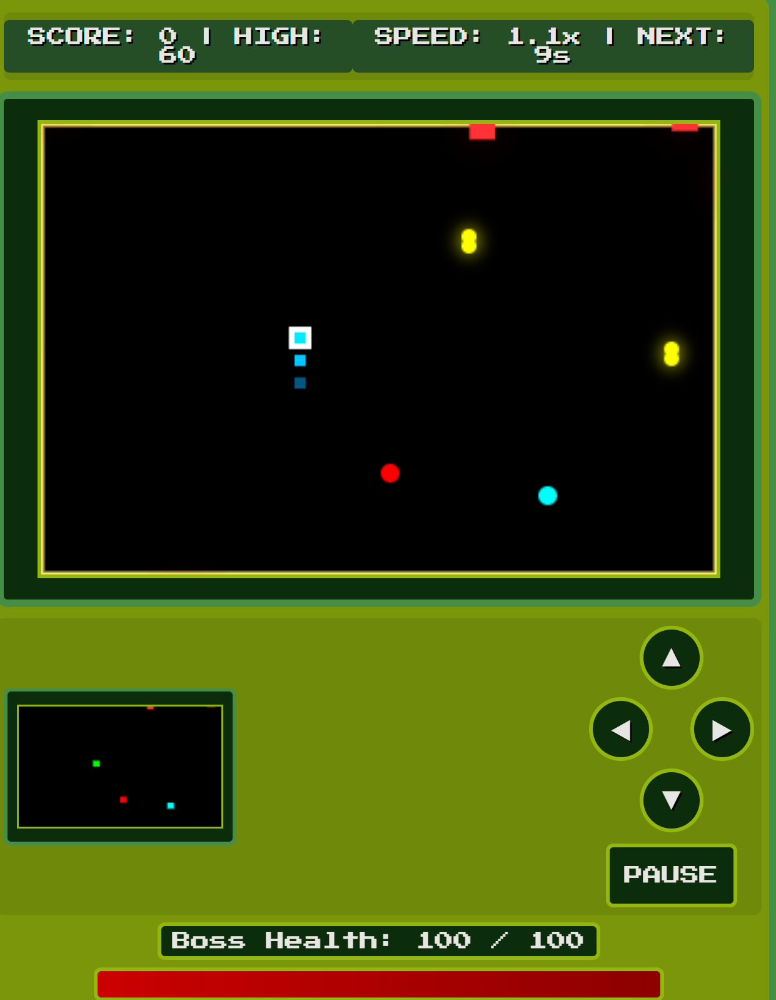

# Ultimate Snake Game (Game Boy Style)

A modern take on the classic Snake game with a Game Boy-inspired UI and additional features.

## Features

- 🎮 Game Boy-inspired retro UI
- 🐍 Classic snake gameplay with modern twists
- 🗺️ Mini-map for better navigation
- 👾 Boss battles and enemy mechanics
- 🏆 Achievement system
- ⚡ Special power-ups and effects
- 📱 Mobile-friendly controls
- 🎵 Retro sound effects

## Controls

- **Keyboard**: Arrow keys for movement
- **Mobile**: On-screen D-pad
- **Pause**: ESC key or Pause button
- **Restart**: Button appears after game over

## Special Features

- **Boss Health System**: Track and damage the boss
- **Speed System**: Snake speeds up as you progress
- **Special Food**: Timed power-ups appear regularly
- **Achievement Popup**: Get notified of your accomplishments
- **High Score**: Local storage saves your best score

## Technical Details

Built with:
- HTML5 Canvas
- Vanilla JavaScript
- CSS3 with Game Boy color palette
- Responsive design
- Pixel-perfect "Press Start 2P" font

## Getting Started

1. Clone the repository
2. Open `index.html` in a modern browser
3. Start playing!

## Credits

- Font: "Press Start 2P" from Google Fonts
- Sound effects: 8-bit style WAV files
- Color palette: Classic Game Boy greens

## License

MIT License - Feel free to use and modify!
